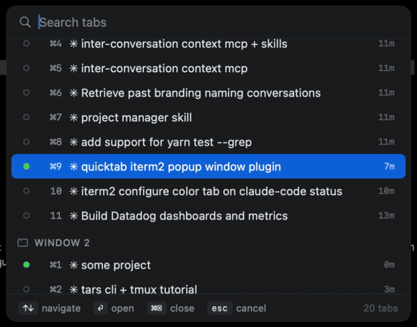
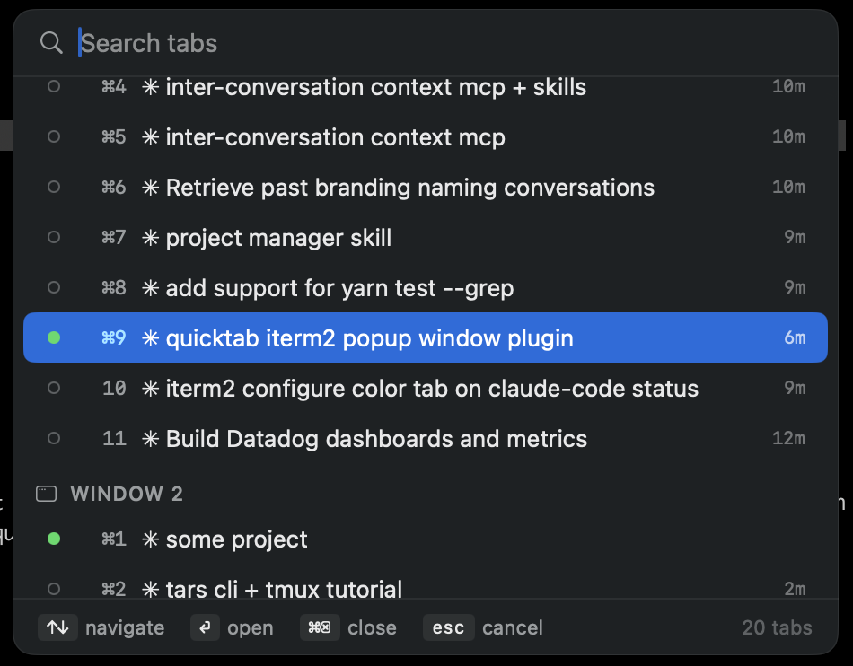

# quicktab-iterm2

A Spotlight-style command palette for iTerm2 tabs. Press a hotkey, fuzzy-search across **all** open tabs in **all** windows, jump in.



> Built for people who keep way too many terminal tabs open and lose track of which is which.

## Why

iTerm2 has Cmd+1..9 for in-window tab switching, but once you're past 9 tabs or across multiple windows, finding the right one is a hunt. Native macOS has no "command palette for terminal tabs." This adds one.

## What it does

- **Hotkey opens a popup picker** at the top-right of the focused iTerm2 window
- **Fuzzy search** by tab title — subsequence match with scored ranking
- **Pre-selects the currently-active tab** so you can re-find it with one keypress
- **Last-activity indicator** per tab (e.g. `5m`, `3h`, `2d`, `1w`) — based on when the user last typed in that tab, not when the tab last had any output; much more honest signal of staleness
- **Close stale tabs from the picker** via `⌘⌫` or hover X — works on the highlighted row, picker stays open so you can clean up a streak
- **Toggle close** — pressing the hotkey while the popup is open closes it
- **Auto-dismiss on click-outside / Esc**
- **Native macOS look** — SwiftUI glass material, SF Symbols, system accent, adapts to light/dark mode

## Screenshots



Tab list grouped by window. Each row shows: active-tab dot, `⌘N` shortcut hint, tab title, and last-activity time on the right (`6m`, `9m`, `10m`, etc.). Hover any row to reveal the close button.

## Requirements

- macOS 14+ (built and tested on macOS 26 Tahoe)
- iTerm2 3.6+
- Xcode Command Line Tools (for `swiftc`, used to compile the picker once at install)

The installer checks all of these.

## Install

```bash
curl -fsSL https://raw.githubusercontent.com/tmilar/quicktab-iterm2/main/bootstrap.sh | bash
```

Then bind a hotkey: iTerm2 → **Settings** → **Keys** → **Key Bindings** → **+**

- **Keyboard Shortcut:** press your chord (e.g. `⌘E` or `⌘⌥Space`)
- **Action:** `Invoke Script Function`
- **Function Call:** `quicktab_show()`
- **Scope:** For all sessions
- Save.

iTerm2 will prompt you once to grant the Python API permission — accept. You're done.

> Wary of `curl | bash`? Audit first: `curl https://raw.githubusercontent.com/tmilar/quicktab-iterm2/main/bootstrap.sh`.

### Manual install

```bash
git clone https://github.com/tmilar/quicktab-iterm2.git
cd quicktab-iterm2
./install.sh
```

The installer:

1. Verifies iTerm2 and Swift toolchain are present
2. Copies the picker source + shim to `~/.local/bin/`
3. Copies the autolaunch RPC script to `~/Library/Application Support/iTerm2/Scripts/AutoLaunch/`
4. Builds the picker binary into `~/.cache/quicktab-iterm2/picker`
5. Starts the autolaunch script (no iTerm2 restart needed)

Then bind the hotkey as shown above.

## Use

Press your chord in any iTerm2 window. The picker appears.

| Keyboard | Mouse | Action |
|---|---|---|
| `↑` `↓` | — | navigate the list (skips window-section headers) |
| type characters | — | fuzzy-filter by title |
| `⏎` | click a row | open the highlighted/clicked tab |
| `⌘⌫` | click X (appears on hover) | close the highlighted tab; picker stays open |
| `Esc` | click outside the popup | dismiss |
| hotkey again | — | toggle the popup closed |

## Architecture

Two-piece design:

```
┌────────────────────────────────────┐
│ iTerm2 AutoLaunch (long-lived)     │
│ autolaunch.py                      │
│  • registers quicktab_show RPC     │
│  • collects tabs via iTerm2 API    │
│  • spawns picker subprocess        │
│  • streams events back from picker │
└──────┬─────────────────────────────┘
       │ stdin: tabs + anchor JSON
       │ stdout: newline-delimited events
       ▼
┌────────────────────────────────────┐
│ Picker subprocess (Swift)          │
│ picker.swift → swiftc -O           │
│  • reads JSON from stdin           │
│  • renders SwiftUI popup           │
│  • emits {"event":"close",...}     │
│    for ⌘⌫ / hover-X actions        │
│  • emits {"event":"select",...}    │
│    on commit, then exits           │
└────────────────────────────────────┘
```

The RPC handler is fire-and-forget: it spawns the picker as an asyncio background task and returns immediately, so iTerm2's 5-second RPC timeout doesn't fire while the user is reading the picker.

## Configuration

### Changing the hotkey

Re-do the binding step in **Install** with a different chord. The project ships with no hardcoded shortcut — whatever you bind in iTerm2 fires the popup.

### Multiple hotkeys

Bind multiple chords to the same function. e.g. `⌘E` for keyboard-friendly use, plus `⌘⌥Space` as a Spotlight-adjacent alternative — both invoke `quicktab_show()`.

### Logging

Silent by default. To get verbose diagnostics (helpful when reporting a bug or just curious):

```bash
export QUICKTAB_DEBUG=1
```

…then trigger the popup. Logs land in:

- `/tmp/quicktab-debug.log` — autolaunch script (parent)
- `/tmp/quicktab-debug-swift.log` — picker subprocess

## Uninstall

```bash
./uninstall.sh
```

Reverses everything `install.sh` did: stops the autolaunch script and any running picker, removes binaries/sources from `~/.local/bin`, removes the autolaunch script from iTerm2's `AutoLaunch/` directory, clears `~/.cache/quicktab-iterm2/` and the temp/pid files. The iTerm2 hotkey binding stays — remove it manually in **Settings → Keys → Key Bindings**.

## How it works under the hood

The "last activity" signal is the key trick. iTerm2's Python API doesn't expose a "last user-interaction time" variable per tab. What it does expose is `session.tty` — the path to the pseudo-terminal device, e.g. `/dev/ttys011`. On macOS, that device's filesystem timestamps are useful:

- `mtime` updates whenever bytes are **written** to the terminal — but this is noisy: shell prompts auto-redraw, `oh-my-zsh` and `starship` plugins tick per second, iTerm2 sends escape sequences for window-title updates, long-running commands print output. A "stale" tab can have a fresh mtime just from these.
- `atime` updates only when the foreground process **reads** the device, which is what happens when the user types and the shell consumes the input. This is the real signal for "user touched this tab".

quicktab-iterm2 reads `atime` via `os.stat`, sends the timestamp to the picker, and the picker formats it as a relative-time label at the right edge of each row.

## Roadmap

The core idea ports to other terminals with varying effort. Most promising next direction is a `quicktab-tmux` sibling project — `tmux list-windows` + `fzf` in a tmux popup covers macOS, Linux, and WSL in one shot for the audience that already lives in tmux. Kitty and WezTerm are tractable via their scripting APIs but require a separate Linux UI. Terminal.app would work via AppleScript at the cost of losing the activity-time signal. Open an issue if you'd actually use one of these — concrete demand sets the priority.

## Known limitations

- macOS only (Cocoa + SwiftUI)
- iTerm2-specific. Doesn't work with Terminal.app, Alacritty, Kitty, Ghostty.
- Requires Automation → System Events permission for foreground activation (granted once on first prompt).
- Tabs with shell processes that read aggressively (e.g. `tail -f` on /dev/null doesn't count; but `cat | grep ...` consuming the user's input would still register).

## License

MIT — see [LICENSE](./LICENSE).
